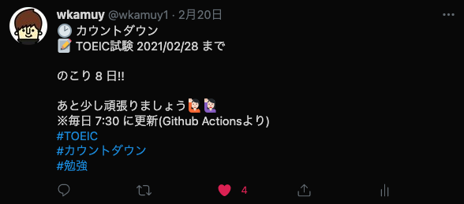

# tweet-countdown

tweet-coutdown is a Javascript Action that tweets the number of days left until the target date :bird: .



## Usage

Edig `.github/workflows/main.yml` to your liking. For example as below.

```.github/workflows/main.yml
name: 'tweet-coutdown'
on:
  schedule:
    - cron: '30 22 * * *'

jobs:
  build:
    runs-on: ubuntu-latest
    steps:
      - uses: actions/checkout@v2
      - run: |
          npm install && npm run build && npm run package
      - uses: ./
        with:
          consumer_key: ${{ secrets.TWITTER_API_KEY }}
          consumer_secret: ${{ secrets.TWITTER_API_SECRET_KEY }}
          access_token_key: ${{ secrets.TWITTER_ACCESS_TOKEN }}
          access_token_secret: ${{ secrets.TWITTER_ACCESS_TOKEN_SECRET }}
          first_message: |
            🕑 カウントダウン
            📝 TOEIC試験 2021/03/21 まで
          target_date: '2021/03/21'
          last_message: |
            あと少し頑張りましょう🙋🏻🙋🏻‍♀️
            ※毎日 7:30 に更新(Github Actionsより)
            #TOEIC
            #カウントダウン
            #勉強
```

Result


## License

[MIT](https://choosealicense.com/licenses/mit/)
